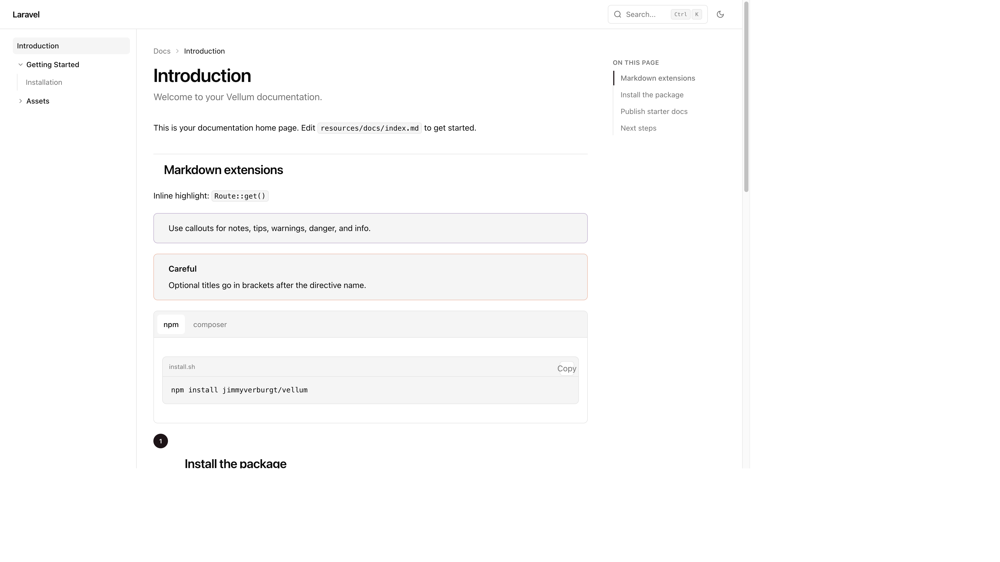
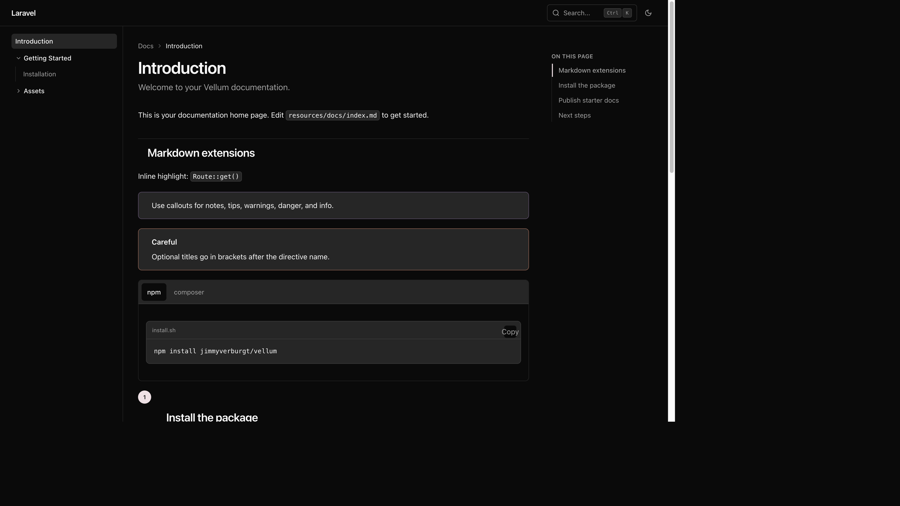

# Vellum

Markdown documentation sites for Laravel.

Pre-1.0: the API may change.

## Requirements

- PHP 8.4+
- Laravel 11, 12, or 13

## Quick start

```bash
composer require jimmyverburgt/vellum
php artisan vellum:install
```

Open `/docs`. Edit Markdown under `resources/docs/`.

Compile the cache during deploy:

```bash
php artisan vellum:build
```

## What it includes

- Markdown extensions: callouts, tabs, steps, cards, code blocks, heading anchors
- Client-side search
- Optional versioned docs
- Static HTML export (`vellum:export`)
- Light / dark / system theme

## Screenshots

Light:



Dark:



## Demo

Stub docs deploy via Cloudflare Workers (`wrangler.toml` + `demo-dist`). After the first Git-connected deploy, use the `*.workers.dev` URL from the Cloudflare dashboard.

## Configuration

`config/vellum.php` (published by `vellum:install`).

## Commands

| Command | Description |
| --- | --- |
| `php artisan vellum:install` | Publish config, starter Markdown stubs, and public assets |
| `php artisan vellum:build` | Compile Markdown into the Vellum cache |
| `php artisan vellum:clear` | Clear the compiled cache |
| `php artisan vellum:export` | Export a static HTML site (`--out=` optional) |

## Publishing

```bash
git tag v0.1.0
git push origin v0.1.0
```

Submit the repo once at [https://packagist.org/packages/submit](https://packagist.org/packages/submit). Packagist reads the Git tag; do not add a `version` field to `composer.json`.

## License

MIT. See [LICENSE.md](LICENSE.md).
